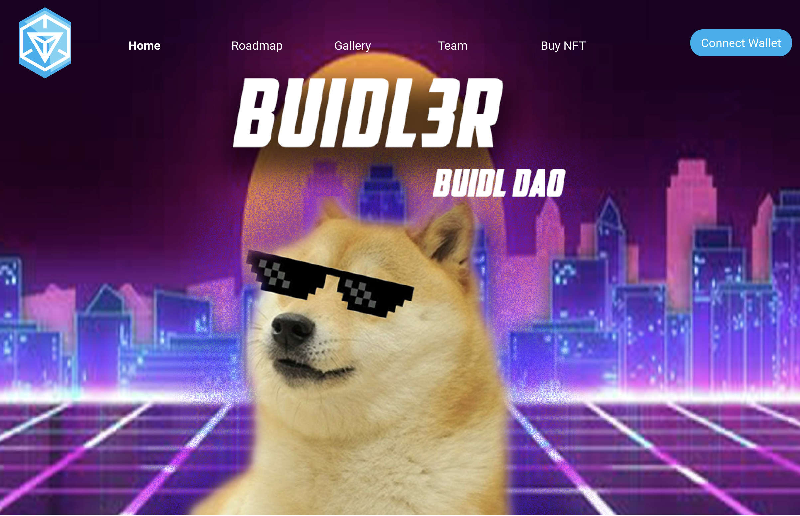

# BuiDL-Academy
This is an NFT launchpad site project built to learn web 3 

## Lessons Learned 💡

Here's what i learnt while building this project (**In Progress**)

The challenges i faced - 

how did i overcome them -

## Screenshots

Soon! 

## Tools Used

**Design**: Figma & Adobe photoshop

**Code:** Web3.js, Hardhat, Solidity, React  

## Contributing

Contributions are always welcome!

See `contributing.md` for ways to get started.

Please adhere to this project's `code of conduct`.

